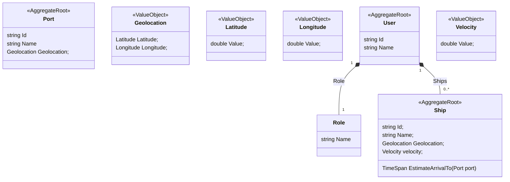

# TASKS

- [x] Add system user
- [x] Writing basic integration tests with WebApplicationFactory
- [x] Add API Versioning
  - [x] Managing API Versions in Swagger
  - [x] https://medium.com/@celery_liu/asp-net-core-web-api-with-swagger-api-versioning-for-dotnet-8-c8ce2fd7808c
- [ ] Generating a code coverage report
- [ ] CI/CD for ASP.NET Core Using Azure Pipelines and GitHub Actions
- [x] Handling exceptions
- [x] Add get token endpoint for system user
- [x] Implementing rate-limiting
- [x] Add users management end points
- [x] Using model validation
- [x] Add ports using data [here](https://github.com/marchah/sea-ports/blob/master/lib/ports.json)
- [x] Configuring the Swagger UI to support authorization
- [x] Role-based authorization
- [x] Query nearest ports to a ship referred [here](https://learn.microsoft.com/en-us/ef/core/modeling/spatial)
- [ ] Secure the DB connection string

# AE Backend Code Challenge

The goal of this challenge is to build a solution comprised of REST APIs that finds the closest port to a given ship and calculates the estimated arrival time based on velocity and geolocation (longitude and latitude) of given ship. Requirements are:

- Each user has a name and role. Each user can be assigned one or more ships. Develop basic REST APIs to manage users.
- Each port has a name and geolocation. Seed your solution with initial (or randomly generated) port data. No REST API is required for creating ports.
- Each ship has a name, a unique ship id, geolocation (current longitude and latitude of the ship) and velocity. Each ship can be assigned to one or more users. Develop basic REST APIs to manage ships.
- Develop an API which returns the details of closest port and estimated arrival time of given ship to the closest port.

Using C# is a must for this solution. xUnit is a must for testing.
Aside from that, feel free to use any technologies/tools/frameworks/libraries ...etc you prefer.

Challenge delivery time should not be longer than a week.

## Domain Models



## Stories

1. As a consumer of the API, I want to be able to add users to the system.
2. As a consumer of the API, I want to be able to see all users in the system.
3. As a consumer of the API, I want to be able to update ships assigned to a user.
4. As a consumer of the API, I want to be able to add ships to the system.
5. As a consumer of the API, I want to be able to see all ships in the system.
6. As a consumer of the API, I want to be able to see ships assigned to a specific user.
7. As a consumer of the API, I want to be able to see ships unassigned in the system.
8. As a consumer of the API, I want to be able to update velocity of a ship.
9. As a consumer of the API, I want to be able to see the closest port to a ship with estimated arrival time to the port together with relevant details.

Feel free to make asumption on anything that is not stated in the description.

## Deliverable

Create a github repo and share the link with us via e-mail.

## What are we looking for?

Following aspects will be taken into the consideration for the evaluation:

- Code quality and testing
- Code structure
- Error and exception handling
- Best practices and principles
- Basic level of system design
- Documentation of your solution as a README file

## Nice to have

- Swagger UI
- Docker
- Some basic CI scripting

Should you have any questions, feel free to send us an e-mail.

## How to Run

1. Create `db/password.txt`. Fill in with any password, let say:

```
Abcd1234
```

This password will be used for the `db` service on `compose.yaml`.

2. Setup the HTTP first:

- Mac OS

```
dotnet dev-certs https -ep ${HOME}/.aspnet/https/aspnetapp.pfx -p password
dotnet dev-certs https --trust
```

- Windows using Linux containers (NOTE: Not tested, yet)

```
dotnet dev-certs https -ep %USERPROFILE%\.aspnet\https\aspnetapp.pfx -p password
dotnet dev-certs https --trust
```

3. Run the tests:

```
make test
```

You must have dotnet sdk installed in your system since the tests is not running inside a Docker container.

4. Run

```
make
```

Wait until the startup finished. The system will try to execute the database migrations and seeder. Wait until you see message `Hosting started` in Docker Desktop.

Read the `View Swagger` section to know how to call the API.

## View Swagger

Make sure you have followed the steps on `How to Run` properly. Open

```
https://localhost/swagger
```

1. Retrieve login token to call API through Swagger

1. Login using email: `irwansyah@gmail.com` and password: `Abcd1234!`
1. Retrieve the token
1. Click the `Authorize` button on Swagger and enter `Bearer <TOKEN>`. Where `<TOKEN> is the token you get from Login
1. Choose and call an API
